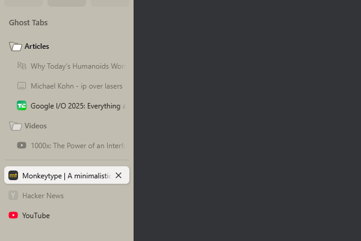

# Ghost Tabs

A Zen Browser mod that makes unloaded tabs & folders appear ghost-like by making them grayscale and transparent.
The goal is to make them easier to distinguish from loaded tabs, while still being visible enough to identify them.

*Inspired by [Felkazz/zen-browser-better-unloaded-tabs](https://github.com/Felkazz/zen-browser-better-unloaded-tabs), which at the time of writing was no longer maintained.*

## Installation

### Via Zen Browser Mods (Recommended)

1. Visit [https://zen-browser.app/mods/](https://zen-browser.app/mods/)
2. Search for "Ghost Tabs" and install the mod

### Manual Installation

1. Copy the `chrome.css` file to your Zen Browser profile's `chrome` folder
2. Restart Zen Browser

## How it works

This mod makes the following elements appear "ghost-like" (grayscale and semi-transparent):

- **Unloaded tabs**: Tabs that are not currently active appear ghosted to distinguish them from loaded content
- **Folders with only unloaded tabs**: When a folder contains exclusively unloaded tabs, the folder itself appears ghosted
- **Exclusions**: Folders being renamed (name editing) remain fully visible for usability
