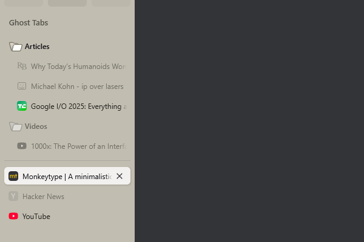

# Ghost Tabs

A Zen Browser mod that makes unloaded tabs & folders appear ghost-like. Now fully customizable with saturation and transparency controls.

The goal is to make them easier to distinguish from loaded tabs, while still being visible enough to identify them.

*Inspired by [Felkazz/zen-browser-better-unloaded-tabs](https://github.com/Felkazz/zen-browser-better-unloaded-tabs), which at the time of writing was no longer maintained.*



## Installation

### Via Zen Browser Mods (Recommended)

Visit the [Ghost Tabs Mod Page](https://zen-browser.app/mods/c01d3e22-1cee-45c1-a25e-53c0f180eea8/) and click `Install Mod`

If link is broken:

1. Visit [https://zen-browser.app/mods/](https://zen-browser.app/mods/)
2. Search for "Ghost Tabs" and install the mod

> [!WARNING]
> The version on the Zen mod store is **outdated** and has no settings. The store was archived before the update was merged, so it can't be updated for now. Follow the steps below to update it to the current version from this repository.

#### Updating the store version

*Thanks to [@Hix0r](https://github.com/Hix0r) for this workaround ([#7](https://github.com/Seismix/zen-ghost-tabs/issues/7)).*

1. Go to `about:profiles` and open your profile's root folder
2. Close Zen Browser
3. Open `zen-themes.json`, find the Ghost Tabs entry and add `"preferences": true,` right before `"author": "Seismix"` (mind the commas)

   ```diff
   - ...,"author":"Seismix",...
   + ...,"preferences":true,"author":"Seismix",...
   ```
4. In the profile folder, go to `chrome/zen-themes/c01d3e22-1cee-45c1-a25e-53c0f180eea8`
5. Replace `chrome.css` and add `preferences.json` from this repository
6. Start Zen Browser (if the settings don't show up, toggle the mod off and on again in the mod settings)

### Manual Installation

1. Copy the `chrome.css` file to your Zen Browser profile's `chrome` folder
2. Add `@import "chrome.css";` at the top of `userChrome.css` in the same folder
3. In `about:config`, create `mod.ghost_tabs.bw_enabled` as a boolean set to `true` to enable the Black & White effect
4. Restart Zen Browser

> [!NOTE]
> The settings page is only available when installed via Zen Mods. To change saturation or opacity, edit the fallback values in `chrome.css` (`--mod-ghost_tabs-saturation, 0` and `--mod-ghost_tabs-opacity, 50`).

## Customization

You can customize the appearance of Ghost Tabs via the Zen Mods settings page (only available when installed via Zen Mods, see [Manual Installation](#manual-installation) otherwise):

- **Saturation (0-100)**: Adjust how much color the ghosted tabs retain (0 is fully black & white).
- **Opacity (0-100)**: Adjust the transparency level of the ghosted tabs.
- **Enable Black & White effect**: A quick toggle to enable/disable the grayscale filter entirely.

## How it works

This mod makes the following elements appear "ghost-like" (grayscale and semi-transparent):

- **Unloaded tabs**: Tabs that are not currently active appear ghosted to distinguish them from loaded content
- **Folders with only unloaded tabs**: When a folder contains exclusively unloaded tabs, the folder itself appears ghosted
- **Exclusions**: Folders being renamed (name editing) remain fully visible for usability
